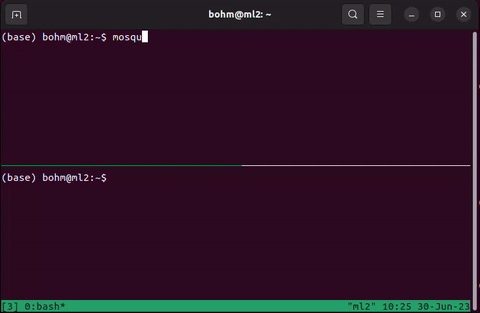

# Quaid-SIM

A simulated environment constructed using the MuJoCo physics engine. This simulation operates in real-time, mirroring the same MQTT message broker interface used by the actual robot. 
This ensures that the simulation incorporates the same kind of network communication, including associated delays. Additionally, the simulated controller can operate on the same MCU that the physical robot utilizes, subjecting the simulation to identical computational constraints. 
This also facilitates a more realistic evaluation of the quantization experiments, as the inference is conducted entirely on-board the MCU but controlling the simulated robot instead of the real hardware.

!

### Building
Install prereqs:

    sudo apt install libyaml-cpp-dev libglfw3-dev

Download MuJoCo binaries from [here](https://github.com/deepmind/mujoco/releases) (tested with version 2.3.1), untar and update the location in the [CMakeLists.txt](CMakeLists.txt).

To build:

    mkdir build
    cd build
    cmake ..
    make -j8

You will need MQTT server up and running before starting the sim.

### MQTT Server
MQTT, which stands for Message Queuing Telemetry Transport, is a lightweight messaging protocol designed for constrained devices and low-bandwidth, high-latency or unreliable networks. It was originally developed by IBM in the late 1990s for monitoring remote sensor nodes, and is now an open standard used for Internet of Things (IoT) devices, where a small code footprint is required and/or network bandwidth is at a premium.

Eclipse Mosquitto is one of the most popular MQTT brokers. MQTT, or Message Queuing Telemetry Transport, is a protocol designed for the transmission of messages over networks with high latency or low bandwidth.
    
    sudo apt install mosquitto mosquitto-clients

To enable anonymous access, add this line:

    allow_anonymous true

at the end of the config file `/etc/mosquitto/mosquitto.conf`.

Restart the mosquitto server:

    sudo systemctl restart mosquitto

You can now test if mosquitto server is working. You will need 2 terminal windows (or tmux with 2 panes).
In the first window, start the subscriber that will be listening for messages on queue `testy/testy`:

    mosquitto_sub -t testy/testy

In the second window, send a message to the same queue:

    mosquitto_pub -t testy/testy -m Testy

Your first window should now show that the message was received:
.

### Settings
The default settings file is [config/settings.yaml](config/settings.yaml) (can be overridden using a command line argument `-c path_to_config.yaml`).

#### MQTT Settings
There are 2 settings:
    
- `mqtt_server_ip`: the IP address (or host name) of the MQTT server. If using the localhost (as described in the previous section) set it to `localhost` or `127.0.0.1`. For remote MQTT server, use the respective hostname/IP address
- `mqtt_queue_no`: this determines the MQTT topics (queues) that the SIM will be listening to and where the observations will be streamed. This allows multiple SIMs to be running on a single MQTT server (not necessarily on a single computer). By default, it is set to 100 which means the queues will end in `/r100`. It can be overridden from by commandline argument `-q` followed by the identifier. 

There are 3 topics/queues (the last number depends on the `mqtt_queue_no` setting):
- `quaid/act/r100`: this is where the sim is listening for actions
- `quaid/obs/r100`: this is where the proprioceptive observations are streamed (at the moment it is only the servo positions)
- `quaid/mocap/r100`: this is where the position and rotation is streamed (simulating the Mocap feed on the real-world robot)

#### Streaming Delays
These settings determine the frequency of the observations/mocap streaming:
- `obs_streaming_delay`: observations streaming delay. By default, it is set to 25, which results in the streaming frequency of 40Hz.
- `mocap_streaming_delay`: streaming delay of Mocap data.

#### Sensors
At the moment there are only settings for the sensor noise by providing a standard deviation for the zero based Gaussian noise added to the sensor readings [as described here](https://mujoco.readthedocs.io/en/stable/modeling.html#sensors):
- `position_noise`: sets the noise for the position sensor. Using the best trained policies, the robot moves about 0.1 unit per step (it is multiplied by 10 before streaming), but this is much less during the training so setting it to 0.1 creates a fairly noisy data.
- `orientation_noise`: sets the noise for the orientation sensor. This sensor outputs Quaternion, i.e. the values from interval [-1, 1], so again setting it 0.1 will generate quite noisy data.

### Running
From the build dir:

    ./quaid_sim_cpp

There are 3 commandline args:

- `-m,--model`: the robot definition file. Defaults to `assets/quaid.xml`
- `-c,--config`: the config file described above. Defaults to `config/settings.yaml`
- `-q,--mqtt_queue_no`: the queue no that will be appended to the end of the mqtt topics. Defaults to the one set in the settings file above.

### MQTT Interface
The robot is controlled entirely through the MQTT interface. This closely mimics the real-world robot.

#### Sending Actions
The sim listens for actions on topic `quaid/act/r100`. 

The messages are in the following format `command[payload]`, where the command is a single character and the (optional) payload is either a number or a comma-separated list of numbers. Here's the list of accepted commands:

-`a` followed by 8 decimal numbers from interval [-1, 1] (e.g. `a-0.5,0.5,-0.345,0.4,1,1,0,0`). This is the main command used during the training and inference. It is used by the environment/policy to send the action (there's one number for each servo). It will set the servo position by first going through the exponential filter to prevent too abrupt movements.
-`b` followed by 8 integers, the scale is based on the limits defined in [servo_shield.h](include/servo_shield.h) in the vector `Limit limits[16]` (the first number is the min and the second max). This will set the servo position directly, without going through the exponential filter. It's mainly used for testing.
-`u` followed by 1 integer. Sets the observations streaming delay (it will override the delay set in the config file). This allows each training process to use different streaming frequency.
-`f` followed by a float from interval [0, 1]. Sets the exponential filter `c` value. See `set_position_with_filter` method in [servo_shield.cpp](src/servo_shield.cpp) for the formula.
-`r` (no payload) resets the robot by setting the servos to the center position as defined by the limits in [servo_shield.h](include/servo_shield.h) in the vector `Limit limits[16]` (the third number is the center position).
-`e` (no payload) "stand up" command. Sets the servos to the up position as defined by the limits in [servo_shield.h](include/servo_shield.h) in the vector `Limit limits[16]` (the fourth number is the up position).
-`x` (no payload) start streaming the observations
-`y` (no payload) stop streaming the observations
-`m` (no payload) start streaming the mocap data
-`n` followed by 2 floats from interval [0,1] (e.g. `n0.05,0.05`). Sets the sensor noise. The first value is for orientation sensor and the second for position sensor)
-`pTH` followed by integer [-180,180]. Resets the heading marker to the current position of the robot and the heading provided by the angle from the payload.
-`w` (no payload) - resets the camera by positioning it next to the robot.

#### Observations Streaming
The observations are streamed to `quaid/obs/r100` after being enabled by sending `x` command to `quaid/act/r100`.

The format is `S` followed by 15 numbers (some ints some floats) (see [mqtt_controller.cpp](src/mqtt_controller.cpp) method `void MqttController::streamObservations()` for details):

- `time_delta`: time since the last message 
- `0`: not used
- `0.0`: not used (IMU yaw in the real robot)
- `0.0`: not used (IMU pitch in the real robot)
- `0.0`: not used (IMU roll in the real robot)
- `0`: not used (battery voltage in the real robot)
- `0`: not used (current drawn in the real robot)
- `servo_position` - 8 integers - one for each servo position

#### Mocap Data Streaming
The mocap (position/orientation) data is streamed to `quaid/mocap/r100` after being enabled by sending `m` to `quaid/act/r100`.

The format is `S1,` followed 6 floats, 3 for position and 3 for orientation. The position is in format `x, y, z` and the orientation is given as `yaw, pitch, roll` in radians. 

### Simple Demo

